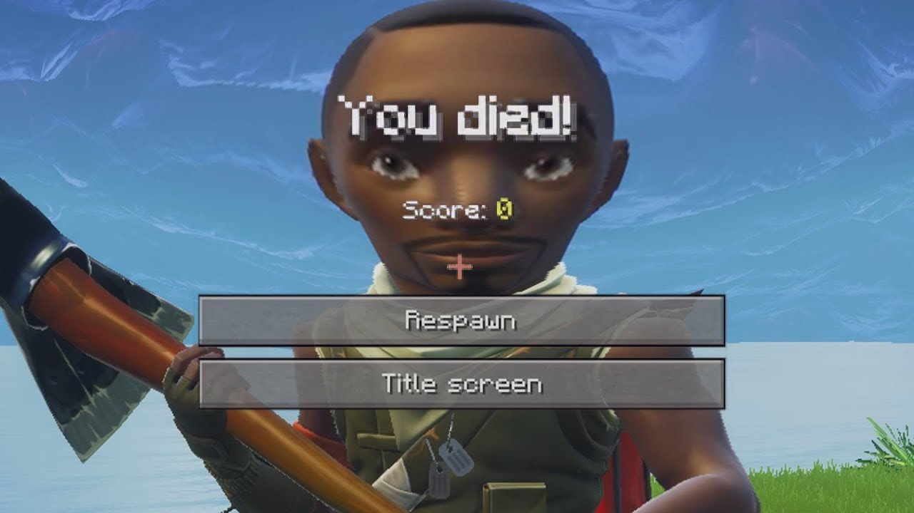

# FORTNUT 2 🌰🔥

> The realest shooter with the dankest MLG twists.
> A Fortnite parody I built solo in Unity — and yeah, I actually shipped it.

[](https://gamejolt.com/games/fortnut2/551302)
&nbsp;


<p align="center">
  
</p>

**Fortnut 2** is a first-person shooter I designed, coded, modeled, and published
entirely on my own. It's a loving parody of a certain battle-royale juggernaut —
"MLG" energy, custom-modeled skins, secrets to find. It started as me messing
around in Unity and ended as a real, downloadable game that strangers could play.

**The theme is a joke. The engineering is not.**

## 🎮 Play it

▶ **[Download on GameJolt](https://gamejolt.com/games/fortnut2/551302)** — standalone **Windows** build (no Unity install needed).

## 🛠️ What's actually under the hood

Every system here is hand-rolled C# (`Assets/Scripts/`), not drag-and-drop templates:

- **First-person movement & camera** — WASD movement, mouse look, and jumping (`Player_Controller`, `Camera_Controller`).
- **Weapons & shooting** — projectile/clone spawning, weapon switching, and a dedicated Uzi spawner (`Instantiate*`, `Change`, `clonespam`).
- **Health & damage** — a health model wired to an on-screen health bar (`Health`, `HealthBar`), plus shoot-to-destroy targets and blood-splatter FX (`destroyedwhenshot`, `bloodsplatter`).
- **Movement toys** — jump pads (`JumpBoost`), a fly/noclip mode (`Fly`), and kill-plane + fall logic for respawning (`DeathPlane`, `fall`).
- **Secrets & scoring** — a hidden door (`HiddenDoor`), enemy head-tracking (`HeadTurn`), and a card-based score system (`FNCARD`, `fncardscore`).

## 🎨 Built end-to-end, solo

- **Code** — all gameplay scripting in **C#** inside **Unity**.
- **3D art** — custom characters and props modeled in **Blender** (yes, `Omega.blend` and `Fishstick.blend` live in here).
- **Ship** — packaged and **published to GameJolt** so anyone could download and play.
- **Timeline** — developed in weekly increments through **2020**, with fixes into **2021**. The commit log is basically a build diary.

## 📈 What I leveled up

- Took Unity from "follow a tutorial" to wiring my own gameplay systems together.
- Learned 3D modeling in Blender and brought my own assets into an engine.
- Sharpened C# — components, instantiation, collisions, and UI binding.
- Most importantly: learned to **finish and ship** to a public platform instead of leaving it in a folder.

## 🚀 Run it from source

```bash
git clone https://github.com/NeilP211/fortnut-2.git
```

1. Open the folder in **Unity Hub** (open with a matching LTS version; let it resolve packages).
2. Load `Assets/Scenes/SampleScene.unity` (or `Assets/QS/Scenes/main.unity`).
3. Press **Play**.

> **Heads up:** this repo ships its full asset library (skyboxes, weapon packs, `.blend` files), so it's a chunky clone — that's intentional. It's the complete, buildable project, exactly as released.

---

*An early passion project. Dumb name, real game, a lot learned.* 🌰
